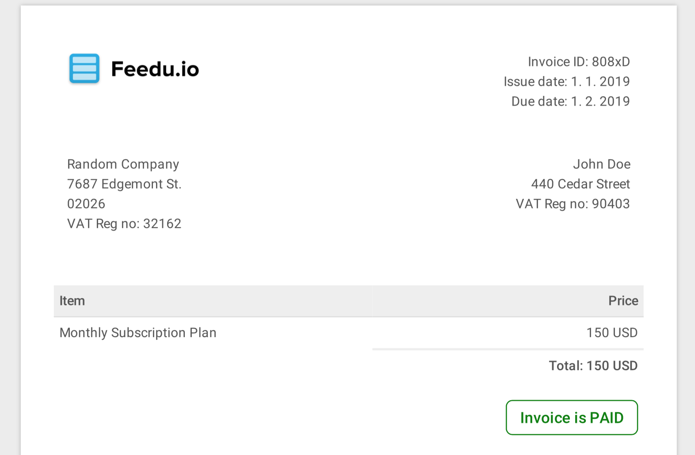

# Google Cloud Function Invoice Generator

Simple invoice generator that takes HTML template and generates PDF invoice based on JSON input.
Example template uses [sparksuite/simple-html-invoice-template](https://github.com/sparksuite/simple-html-invoice-template).




## Demo

Find [PDF demo here](examples/example.pdf).


## Get started

See preview in browser
```bash
node render-preview.js && open preview.html
```

Deploy
- replace `BUCKET_NAME`

```bash
gcloud beta functions deploy generateInvoice --stage-bucket BUCKET_NAME --trigger-http
```

Usage
1. replace `GCF_URL`
2. run following command and see `test-invoice.pdf`

```bash

curl -X POST "GCF_URL" -H "Content-Type:application/json" --data '
{
"id":"808xD",
"dateIssue":"1. 1. 2019",
"dateDue":"1. 2. 2019",
"companyAddressLines":[
  "Random Company",
  "7687 Edgemont St. ",
  "02026",
  "VAT Reg no: 32162"
],
"userAdressLines":[
  "John Doe",
  "440 Cedar Street",
  "VAT Reg no: 90403"
  ],
"item": {
  "name":"Monthly Subscription Plan ",
  "price":"150 USD"
},
"status":"PAID"
}' > test-invoice.pdf
```


## Font license
Used font in this repository is [Roboto](https://fonts.google.com/specimen/Roboto), licensed under [Apache License, Version 2.0](http://www.apache.org/licenses/LICENSE-2.0)